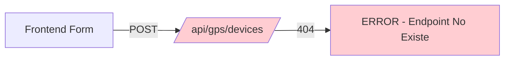

# 📊 Análisis: Lógica de Registro y Conexión de Dispositivos

## 🔍 ESTADO ACTUAL

### ✅ **LO QUE SÍ EXISTE**

#### **Frontend (React)**
- ✅ **Interfaz de gestión** en `DeviceManagement.tsx`
- ✅ **Formulario de registro** con campos:
  - IMEI (15 dígitos)
  - Nombre del dispositivo
  - Descripción
- ✅ **Servicios de cliente** en `deviceService.ts`:
  - `createDevice()` - Crear dispositivo
  - `updateDevice()` - Actualizar dispositivo
  - `deleteDevice()` - Eliminar dispositivo
  - `getAll()` - Listar dispositivos
- ✅ **Gestión de estado** con Redux en `deviceSlice.ts`
- ✅ **Componentes UI** para mostrar lista y estado de dispositivos

#### **Backend (Django)**
- ✅ **Modelo GPSDevice** completo en `models/device.py`
- ✅ **Endpoint de listado**: `GET /api/gps/devices/`
- ✅ **Procesamiento de datos GPS**: 
  - `POST /api/gps/location/` (datos simples)
  - `POST /api/gps/event/` (datos completos con autenticación)
- ✅ **Auto-registro por email** en `email_processor.py`
- ✅ **Auto-creación en servidores**: Meiligao, Concox, SAT
- ✅ **Script de creación** manual: `create_device.py`

---

## ❌ **LO QUE FALTA (GAPS CRÍTICOS)**

### **1. Endpoints CRUD en Backend**

#### ❌ **Endpoints Faltantes:**
```python
# Estos endpoints NO EXISTEN en el backend:
POST   /api/gps/devices/           # Crear dispositivo
PATCH  /api/gps/devices/{imei}/    # Actualizar dispositivo  
DELETE /api/gps/devices/{imei}/    # Eliminar dispositivo
PUT    /api/gps/devices/{imei}/    # Actualizar completo
```

#### ❌ **Views Faltantes:**
```python
# Necesitan implementarse:
@api_view(['POST'])
def create_device(request):
    """Crear nuevo dispositivo"""
    pass

@api_view(['PATCH'])  
def update_device(request, imei):
    """Actualizar dispositivo existente"""
    pass

@api_view(['DELETE'])
def delete_device(request, imei):
    """Eliminar dispositivo"""
    pass
```

### **2. Lógica de Conexión Activa**

#### ❌ **Funcionalidad Faltante:**
- **Test de conectividad** desde frontend al dispositivo
- **Intento de conexión** manual
- **Verificación de respuesta** del dispositivo
- **Configuración remota** del dispositivo
- **Envío de comandos** de configuración

### **3. Validaciones de Registro**

#### ⚠️ **Validaciones Incompletas:**
- **IMEI duplicado** (básico existe, pero falta manejo en frontend)
- **Formato IMEI** (validación solo en frontend)
- **Dispositivo activo** antes de envío de datos
- **Permisos de usuario** para crear dispositivos

---

## 🔧 **FUNCIONAMIENTO ACTUAL**

### **Frontend → Backend (ROTO)**


### **Dispositivo → Backend (FUNCIONA)**


### **Auto-registro (FUNCIONA PARCIAL)**
```mermaid
graph LR
    A[Email/Socket] -->|Auto-create| B[GPSDevice.objects.create()]
    B -->|Success| C[Device Registered]
    
    style B fill:#fff3e0
    style C fill:#fff3e0
```

---

## 📋 **IMPLEMENTACIÓN NECESARIA**

### **1. Completar Backend CRUD**

#### **A. Agregar Views:**
```python
# En skyguard/apps/gps/views.py

@api_view(['POST'])
@permission_classes([IsAuthenticated])
def create_device(request):
    """Crear nuevo dispositivo GPS"""
    try:
        # Validar IMEI
        imei = request.data.get('imei')
        if not imei or len(str(imei)) != 15:
            return Response({'error': 'IMEI must be 15 digits'}, status=400)
            
        # Verificar si ya existe
        if GPSDevice.objects.filter(imei=imei).exists():
            return Response({'error': 'Device already exists'}, status=409)
            
        # Crear dispositivo
        device = GPSDevice.objects.create(
            imei=int(imei),
            name=request.data.get('name', f'Device_{imei}'),
            owner=request.user,
            is_active=True
        )
        
        # Serializar y retornar
        return Response({
            'id': device.id,
            'imei': device.imei,
            'name': device.name,
            'status': 'created'
        }, status=201)
        
    except Exception as e:
        return Response({'error': str(e)}, status=500)
```

#### **B. Agregar URLs:**
```python
# En skyguard/apps/gps/urls.py
urlpatterns = [
    # ... existentes ...
    
    # CRUD endpoints
    path('devices/', views.list_devices, name='list_devices'),      # GET (existe)
    path('devices/create/', views.create_device, name='create_device'),  # POST (NUEVO)
    path('devices/<int:imei>/update/', views.update_device, name='update_device'),  # PATCH (NUEVO)
    path('devices/<int:imei>/delete/', views.delete_device, name='delete_device'),  # DELETE (NUEVO)
]
```

### **2. Implementar Test de Conectividad**

#### **A. Frontend - Botón de Prueba:**
```typescript
// En DeviceManagement.tsx
const testDeviceConnection = async (imei: number) => {
    try {
        setTestingDevice(imei);
        const result = await deviceService.testConnection(imei);
        if (result.success) {
            setDeviceStatus(imei, 'ONLINE');
            showSuccess('Device responded successfully!');
        } else {
            setDeviceStatus(imei, 'OFFLINE');
            showError('Device did not respond');
        }
    } catch (error) {
        showError('Connection test failed');
    } finally {
        setTestingDevice(null);
    }
};
```

#### **B. Backend - Endpoint de Prueba:**
```python
@api_view(['POST'])
@permission_classes([IsAuthenticated])
def test_device_connection(request, imei):
    """Probar conectividad con dispositivo"""
    try:
        device = GPSDevice.objects.get(imei=imei)
        
        # Enviar comando de ping
        command_service = DeviceCommandService()
        result = command_service.send_ping(device)
        
        if result.success:
            device.update_connection_status('ONLINE')
            return Response({
                'success': True,
                'message': 'Device responded',
                'response_time': result.response_time
            })
        else:
            device.update_connection_status('OFFLINE')
            return Response({
                'success': False,
                'message': 'Device did not respond'
            })
            
    except GPSDevice.DoesNotExist:
        return Response({'error': 'Device not found'}, status=404)
```

### **3. Flujo de Registro Completo**

#### **A. Wizard de Registro:**
```typescript
// Proceso paso a paso
const deviceRegistrationSteps = [
    { step: 1, title: 'Device Information', component: 'DeviceInfoForm' },
    { step: 2, title: 'Network Configuration', component: 'NetworkConfigForm' },
    { step: 3, title: 'Connection Test', component: 'ConnectionTestForm' },
    { step: 4, title: 'Activation', component: 'ActivationForm' }
];
```

#### **B. Configuración Automática:**
```python
def configure_device_settings(device, config):
    """Configurar dispositivo automáticamente"""
    commands = [
        f"SET_SERVER_URL,{config.server_url}",
        f"SET_TOKEN,{config.auth_token}",
        f"SET_INTERVAL,{config.report_interval}",
        "RESTART_DEVICE"
    ]
    
    for command in commands:
        send_command_to_device(device, command)
```

---

## 🚀 **PLAN DE IMPLEMENTACIÓN**

### **Fase 1: Backend CRUD (Prioridad Alta)**
1. ✅ Crear views para CRUD
2. ✅ Agregar URLs correspondientes
3. ✅ Implementar validaciones
4. ✅ Testing de endpoints

### **Fase 2: Test de Conectividad (Prioridad Media)**
1. ✅ Implementar comando ping
2. ✅ Agregar endpoint de test
3. ✅ UI para test en frontend
4. ✅ Indicadores visuales de estado

### **Fase 3: Wizard de Registro (Prioridad Baja)**
1. ✅ Diseñar flujo paso a paso
2. ✅ Implementar componentes UI
3. ✅ Integrar con backend
4. ✅ Documentación de uso

---

## 📊 **DIAGNÓSTICO ACTUAL**

### **✅ Funcionalidades Trabajando:**
- ✅ Listado de dispositivos
- ✅ Recepción de datos GPS
- ✅ Auto-registro por servidores
- ✅ Procesamiento de eventos
- ✅ Visualización en frontend

### **❌ Funcionalidades Rotas:**
- ❌ Registro manual desde frontend
- ❌ Edición de dispositivos
- ❌ Eliminación de dispositivos
- ❌ Test de conectividad
- ❌ Configuración remota

### **⚠️ Funcionalidades Parciales:**
- ⚠️ Auto-registro (solo por servidores, no por frontend)
- ⚠️ Validaciones (solo frontend, falta backend)
- ⚠️ Gestión de estados (básica, falta refinamiento)

---

## 🎯 **CONCLUSIÓN**

**Estado Actual:** La funcionalidad de registro y gestión de dispositivos está **INCOMPLETA**. 

**Problema Principal:** Desconexión entre frontend y backend - el frontend tiene la UI pero el backend no tiene los endpoints CRUD necesarios.

**Solución Inmediata:** Implementar los endpoints faltantes en el backend para que el frontend funcione correctamente.

**Impacto:** Sin estos endpoints, los usuarios no pueden registrar dispositivos desde la interfaz web, lo que limita significativamente la funcionalidad del sistema. 